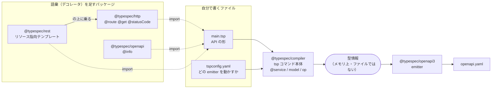
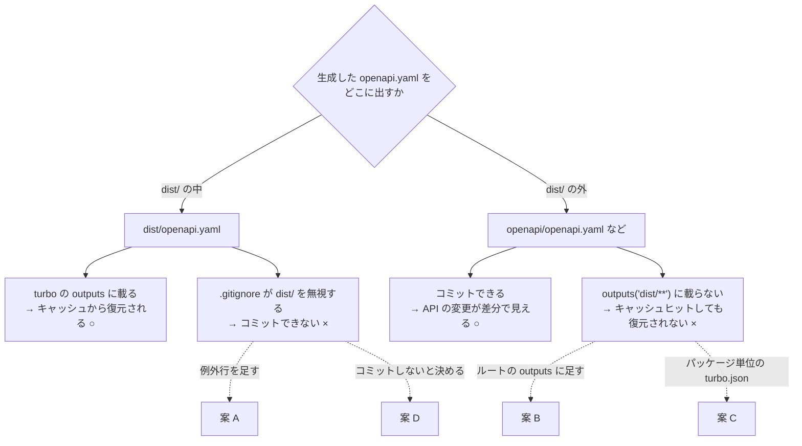
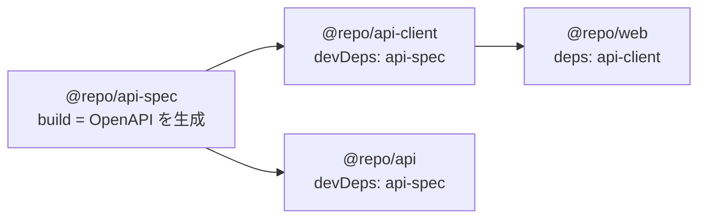

# 004: TypeSpec で `/health` を定義し、OpenAPI を生成する

- ステータス: 未着手（**着手可能**）
- 見積: 2h / 実績: -h
- 依存: **003（完了）** — turbo のタスクに実物のビルドが乗り、`outputs` の扱いを一度踏んでいる前提
- 関連: [ADR 20260812-0659 Go採用と TypeSpec 起点の契約](../adr/20260812-0659-backend-go-openapi-contract.md)、[ADR 20260812-1313 ディレクトリ構成](../adr/20260812-1313-monorepo-directory-layout.md)、[ADR 20260812-1309 pnpm](../adr/20260812-1309-package-manager-pnpm.md)、[ADR 20260815-2314 ビルド成果物と turbo タスク](../adr/20260815-2314-go-build-output-and-turbo-tasks.md)、[ADR 20260815-2315 ルーターの置き場所](../adr/20260815-2315-router-placement.md)、[CLAUDE.md の制約「API 契約の単一情報源は TypeSpec」](../../CLAUDE.md)
- 本チケットで生まれた ADR: [20260823-1423 OpenAPI の出力先とコミット方針](../adr/20260823-1423-openapi-output-location.md)

## 1. 目的

`packages/api-spec` に TypeSpec を入れて **`/health` を契約として定義**し、そこから **OpenAPI 仕様が生成される**状態にする。あわせて 002 で仮置きした `packages/api-spec` のダミータスクを、実際の生成コマンドに差し替える。

## 2. 背景

[ADR 20260812-0659](../adr/20260812-0659-backend-go-openapi-contract.md) で、**API の契約は TypeSpec に書き、そこから OpenAPI を生成し、さらに Go と TypeScript の両側のコードを生成する**と決まっている。

```text
TypeSpec（唯一の情報源）      ← 004 でここを作る
      │
      ▼
  OpenAPI 仕様                ← 004 でここまで出す
      ├──→ Go サーバーの型      ← 005
      └──→ TypeScript の型      ← 005 以降
```

003 で `/ping` を**手で書いた**。004〜005 は、それが契約駆動に置き換わる過程そのものである。**004 は契約を定義するところまで**で、Go の実装は 005 に残す。契約とコード生成を同時に入れると、生成物が期待と違ったときに「定義が悪いのか、生成器の設定が悪いのか」を切り分けられなくなるため。

`/ping` は 005 で `/health` に置き換わるまで残す。この段階では **`apps/api` に変更を加えない。**

## 3. 事前調査

### 002・003 の結果として、いま在るもの

`packages/api-spec` は **`package.json` が1枚だけ**で、タスクはダミー（`dist/` にファイルを吐くだけ）。

```jsonc
// packages/api-spec/package.json（現状）
{
  "name": "@repo/api-spec",
  "private": true,
  "scripts": {
    "build": "mkdir -p dist && echo built > dist/out.txt", // ← 差し替える
    "test": "echo test @repo/api-spec",
  },
}
```

依存の宣言は既に通っている。`@repo/api-client` と `@repo/api` が `@repo/api-spec` を `devDependencies` に持つため、`dependsOn: ["^build"]` によって **`@repo/api-spec` の `build` が先に走る**（002 で確認済み）。

ルートの `turbo.jsonc` は変わらず `build` の `outputs` を `["dist/**"]` で全パッケージに一律適用している。`.gitignore` は `dist/` を無視する。**この2つが本チケットの論点に直結する**（後述）。

### 用語

先に**パッケージ同士の関係**を1枚で示す。以下の用語は、この図のどこかを指している。



読み取ってほしいのは3点。

1. **コンパイラは OpenAPI を知らない。** `main.tsp` を読んで型情報にするところまでが `@typespec/compiler` の仕事で、ファイルを書くのは emitter。だから出力形式を差し替えられる
2. **`@route` / `@get` はコンパイラの機能ではない。** `@typespec/http` を import して初めて使える。「HTTP の語彙」自体が後付けのパッケージ
3. **左側（語彙）と右側（emitter）は別系統。** `@typespec/openapi` は `@info` という語彙を足すパッケージで、出力する `@typespec/openapi3` とは別物（名前が紛らわしい）

**TypeSpec**

- **何をするものか**: API の形（パス・HTTP メソッド・リクエスト・レスポンス・型）を、TypeScript に似た構文で記述する言語。書いたものから OpenAPI などの成果物を生成する
- **なぜ要るのか**: OpenAPI の YAML は冗長で、共通の型やエラーレスポンスの再利用が書きにくい（[ADR 20260812-0659](../adr/20260812-0659-backend-go-openapi-contract.md) の「型共有に TypeSpec を選ぶ理由」）
- **似た仕組みとの違い**: Protocol Buffers の `.proto` や GraphQL の SDL と同じ「スキーマ言語」の系統。ただし `.proto` が gRPC という通信方式とセットなのに対し、**TypeSpec 自身は通信方式を持たず、既存の OpenAPI / JSON Schema / Protobuf を出力する側に回る**
- **いつからある仕組みか**: Microsoft が Azure の API 定義用に社内で作っていた Cadl が原型で、2022年に TypeSpec へ改称して公開された。比較的新しく、コンパイラが 1.0 に到達したのも最近（今日時点で 1.15.0）

**emitter（エミッタ）**

- **何をするものか**: コンパイラが解釈した型情報を受け取り、**実際にファイルを書き出すプラグイン**
- **なぜ要るのか**: TypeSpec のコンパイラ自身は OpenAPI を知らない。出力形式ごとに差し替えられるよう、言語の解釈と出力が分離されている
- **似た仕組みとの違い**: `protoc` の `--go_out` のような出力プラグインと同じ位置づけ。違いは、TypeSpec の emitter は **npm パッケージとして解決される**こと（`@typespec/openapi3` を `devDependencies` に入れて名前で指定する）

**デコレータ（`@service` / `@route` / `@get`）**

モデルや操作に注釈を付けて、生成物の内容を左右する記法。TypeScript のデコレータに構文は似ているが、**実行時のふるまいを変えるのではなく、コンパイル時のメタデータになる**点が違う。どのデコレータがどのパッケージに属するかが重要で、`@route` / `@get` は `@typespec/http`、`@info` は `@typespec/openapi` が持つ。

**`tspconfig.yaml`**

コンパイラの設定ファイル。`emit`（どの emitter を動かすか）と `options`（emitter ごとの設定）を書く。CLI に毎回 `--emit=...` と渡す代わりになる。**`mise.toml` がツールのバージョンを、`turbo.jsonc` がタスクを固定するのと同じ関係**で、コマンドの引数をファイルに固定する仕組み。

### パッケージ構成と版（今日時点で実測）

| パッケージ           | 版     | 役割                                                                              |
| -------------------- | ------ | --------------------------------------------------------------------------------- |
| `@typespec/compiler` | 1.15.0 | コンパイラ本体。`tsp` コマンドもこれが提供する                                    |
| `@typespec/http`     | 1.15.0 | `@route` / `@get` / `@statusCode` など **HTTP の語彙**                            |
| `@typespec/openapi3` | 1.15.0 | **OpenAPI 3.x を書き出す emitter**                                                |
| `@typespec/openapi`  | 1.15.0 | `@info` など OpenAPI 固有のメタデータ。**要否は判断すること**（後述）             |
| `@typespec/rest`     | 0.85.0 | リソース指向のテンプレート（`@typespec/http` の上に乗る）。**要否は判断すること** |

`@typespec/rest` だけ 1.0 に到達していない。`/health` の定義に必要かどうかは、`@typespec/http` だけで書いてみてから決められる。

### 骨組み

```tsp
// packages/api-spec/main.tsp
import "@typespec/http";

using Http;

@service(#{ title: "???" })
namespace ???;

model ??? {
  ???: ???;
}

@route("/health")
@get
op ???(): ???;
```

> **決めること**: サービスのタイトルと namespace 名 / `/health` が何を返すか（モデルの中身）/ op の名前。
> op の名前は生成される OpenAPI の `operationId` になり、**005 で生成される Go のメソッド名にも影響する**。

`main.tsp` はコンパイラが既定で探すエントリファイル名。`tsp compile <ディレクトリ>` と渡すと、そのディレクトリの `main.tsp` が読まれる。

### 生成コマンドと既定の出力先（実測）

```console
$ pnpm exec tsp compile . --emit=@typespec/openapi3
✔ @typespec/openapi3   tsp-output/@typespec/openapi3/
    tsp-output/@typespec/openapi3/openapi.yaml
```

**既定では `tsp-output/<emitter名>/openapi.yaml` に出る。** `dist/` ではない。

`@typespec/openapi3` の主なオプションと既定値は次のとおり。

| オプション           | 既定値                                              |
| -------------------- | --------------------------------------------------- |
| `emitter-output-dir` | `{output-dir}/@typespec/openapi3`                   |
| `output-file`        | `{service-name-if-multiple}.{version}.openapi.yaml` |
| `file-type`          | `yaml`                                              |
| `openapi-versions`   | `["3.0.0"]`                                         |

`{output-dir}` の既定は `{cwd}/tsp-output`。`{project-root}` などのプレースホルダも使える。サービスが1つで版管理をしていなければ、`output-file` は実際には `openapi.yaml` になる（上の実測どおり）。

`tspconfig.yaml` に書けば、コマンドに毎回オプションを渡さずに済む。

```yaml
# packages/api-spec/tspconfig.yaml
emit:
  - "@typespec/openapi3"
options:
  "@typespec/openapi3":
    emitter-output-dir: "???"
    output-file: "???"
```

### 最大の設計論点 — 生成した OpenAPI をどこに出し、コミットするか

ここで**3つの決定が正面からぶつかる**。

| 決定                                | 内容                                                                                                          |
| ----------------------------------- | ------------------------------------------------------------------------------------------------------------- |
| [CLAUDE.md の制約](../../CLAUDE.md) | 生成物は**コミットし**、CI で再生成して差分が出たら失敗させる                                                 |
| ルートの `turbo.jsonc`              | `build` の `outputs` は `["dist/**"]`。**ここに載らない成果物はキャッシュから復元されない**（003 で体験済み） |
| `.gitignore`                        | `dist/` は**無視する**                                                                                        |

つまり **「`dist/` に出す」と `outputs` はそのまま効くがコミットできず、「コミット対象のディレクトリに出す」と `outputs` に載らない**。どちらを崩すかを決める必要がある。



**×印のどちらを、どう埋めるか**が A〜D の違いである。

|     | 出力先                                                                                                    | 崩すもの                                                                                                                              |
| --- | --------------------------------------------------------------------------------------------------------- | ------------------------------------------------------------------------------------------------------------------------------------- |
| A   | `dist/` に出し、`.gitignore` に例外行（`!packages/api-spec/dist/`）を足す                                 | 「`dist/` は生成物なので無視する」という規約に穴が開く                                                                                |
| B   | `packages/api-spec/openapi/` などコミット対象の場所に出し、**ルートの `turbo.jsonc` の `outputs` に足す** | ルートの定義に、1パッケージのためのパスが混ざる                                                                                       |
| C   | 同上の場所に出し、**`packages/api-spec/turbo.json` を `extends` で作って上書きする**                      | [ADR 20260815-2314](../adr/20260815-2314-go-build-output-and-turbo-tasks.md) の「パッケージ単位の `turbo.json` を作らない」と衝突する |
| D   | 生成物をコミットしない（CI で毎回生成する）                                                               | CLAUDE.md の制約と [ADR 20260812-0659](../adr/20260812-0659-backend-go-openapi-contract.md) の「生成処理を CI で検証」の前提を覆す    |

判断材料として、**ADR 20260815-2314 が `turbo.json` を作らないと決めた理由は「`dist/` に出せば足りるから」**であり、方針そのものではない（同 ADR の「`apps/api/turbo.json` を作らなかった理由」）。前提が変われば C は必ずしも矛盾しない。

もう一点。**「生成物をコミットする」の主目的は、`packages/api-client`（フロントが実際に import する TS の型）にある。** OpenAPI 自体は TypeSpec と生成コードの間の中間物で、コミットする価値は「API の変更が差分としてレビューできる」ことにある。この価値をどう見積もるかで D の是非が変わる。

**この決定は ADR を書く対象。**

### turbo のどのタスクに載せるか

[ADR 20260812-1313](../adr/20260812-1313-monorepo-directory-layout.md) が「`packages/api-spec` の生成タスク名」を宿題に残している。`build` に載せる案と、`generate` のような別タスクを新設する案がある。

現状の依存関係（`package.json` の `dependencies` / `devDependencies` から turbo が組み立てるグラフ）は次のとおり。



矢印は `dependsOn: ["^build"]` が保証する**実行順序**（矢印の元が先に走る）。ここで **`@repo/api-client` と `@repo/api` が待っているのは相手の `build` だけ**である点を踏まえて決めること。生成を `generate` という別タスクにすると、この矢印は `generate` を待たない。

### pnpm の落とし穴（実測で踏んだ）

`@info` のような `@typespec/openapi` 側のデコレータを使う場合、**`@typespec/openapi` を `devDependencies` に明示的に足さないと import が解決できない。**

```console
main.tsp:2:1 - error import-not-found: Couldn't resolve import "@typespec/openapi"
main.tsp:8:2 - error invalid-ref: Unknown decorator @info
```

`@typespec/openapi3` の依存として `node_modules/.pnpm` の中には実在するが、**トップレベルの `node_modules/@typespec/` には `compiler` / `http` / `openapi3` しかリンクされない**ため。これは pnpm が「宣言していない依存は使えない」構造を強制していることの実例で、[ADR 20260812-1309](../adr/20260812-1309-package-manager-pnpm.md) で pnpm を選んだ動機そのものが表面化したもの。

なお `@info` を使わない場合、生成される `info.version` は **`0.0.0`** になる。

## 4. 学習TODO

- [ ] **TypeSpec のコンパイラと emitter が分かれている理由**を説明できる
- [ ] **`tspconfig.yaml` の `emit` / `options` / `emitter-output-dir` / `output-file` の関係**を説明できる。`{output-dir}` と `{project-root}` の違いも
- [ ] **なぜ OpenAPI を直接書かないのか**を、ADR 20260812-0659 を読み直して自分の言葉で説明できる
- [ ] **生成物をコミットする方式と、CI で毎回生成する方式の違い**を説明できる（何が守られ、何が面倒になるか）
- [ ] **pnpm のトップレベル `node_modules` に間接依存が現れない理由**と、それが何を防いでいるかを説明できる
- [ ] `outputs` に載らない場所へ成果物を出したときに何が起きるかを、**003 の経験と結びつけて**説明できる

## 5. 不足情報TODO

- [x] ~~**生成した OpenAPI の出力先と、コミットするかどうかを決める**（上記 A〜D）~~ → **A〜D のいずれでもなく、emitter の既定の出力先（`tsp-output/@typespec/openapi3/openapi.yaml`）に出してコミットする**。`tspconfig.yaml` は作らない（[ADR 20260823-1423](../adr/20260823-1423-openapi-output-location.md)）
- [ ] **turbo のどのタスクで生成するか**（`build` か、`generate` の新設か）→ **暫定で「載せない」（`gen-oa` から手動）。確定は [チケット 005](./005-health-from-generated-types.md) に持ち越し**。OpenAPI → Go の生成と同じ問いのため（[ADR 20260823-1423](../adr/20260823-1423-openapi-output-location.md) の「結果として必要になる決定」）。[ADR 20260812-1313](../adr/20260812-1313-monorepo-directory-layout.md) の宿題
- [x] ~~**`/health` が何を返すか**（フィールドと型）~~ → `status: "OK"`（必須）と `version?: string`（省略可能）
- [x] ~~**`@typespec/rest` を入れるか**~~ → **入れない。** `@typespec/http` の `@route` / `@get` だけで書けた
- [x] ~~**OpenAPI のバージョンを既定の 3.0.0 のままにするか**~~ → **既定の 3.0.0 のまま。** 変える理由が示せなかった
- [x] ~~**`info.version` を埋めるか**~~ → **埋めない。** `@typespec/openapi` を足さず、`0.0.0` のままにする（[ADR 20260823-1423](../adr/20260823-1423-openapi-output-location.md) の「結果として必要になる決定」に残す）

## 6. 実装ステップ

**このチケットにはテストコードを書く対象が無い**（Go の実装は 005）。検証は生成された OpenAPI の内容確認で行う。

1. **依存を入れる**: `packages/api-spec` に `@typespec/compiler` / `@typespec/http` / `@typespec/openapi3` を `devDependencies` として追加する
2. **`main.tsp` を書く**: `/health` の GET を1本だけ定義する。まずは `tspconfig.yaml` を書かずに `pnpm exec tsp compile . --emit=@typespec/openapi3` で通す
3. **生成物を目視する**: `tsp-output/@typespec/openapi3/openapi.yaml` を開き、下の「検証観点」を確認する
4. **出力先とコミット方針を決める**（不足情報TODO の1・2）→ **ADR を書く**
5. **`tspconfig.yaml` を書く**: 決めた出力先を反映し、`--emit` をコマンドから外す
6. **turbo に載せる**: `packages/api-spec/package.json` のダミーを実際の生成コマンドに差し替える。決定に応じて `outputs` の指定と `.gitignore` を整える
7. **キャッシュを検証する**: 生成物を消した状態でルートから `turbo run build` を流し、**キャッシュから復元されること**を確認する
8. **順序を確認する**: ルートから `turbo run build` を流し、`@repo/api-spec` が `@repo/api-client` より先に走ることを確認する
9. **コミットする**: 決定に応じて生成物を追跡対象に含める

### 検証観点（生成された OpenAPI に対して）

- `paths` に `/health` があり、`get` が生えているか
- 200 のレスポンスに、意図した Content-Type とスキーマ参照があるか
- `components.schemas` に定義したモデルが出ているか
- `operationId` が、005 で生成される Go のメソッド名として受け入れられる形か
- `info.title` / `info.version` が意図どおりか
- 先頭の `openapi:` の版が、005 の生成器が読める版か

## 7. 完了条件

- [ ] `packages/api-spec` で `pnpm run build` を実行すると OpenAPI が生成され、上の検証観点をすべて満たす
- [ ] ルートから `pnpm exec turbo run build` が成功し、`@repo/api-spec` が `@repo/api-client` より先に走る
- [ ] **生成物を削除してから `turbo run build` を流すと、キャッシュヒットした上で生成物が復元される**
- [ ] `git status` 上で、生成物の扱いが決定どおりになっている（コミットする決定なら追跡対象に入り、しない決定なら無視されている）
- [ ] OpenAPI を手で編集していない（`main.tsp` だけが情報源になっている）
- [ ] 出力先とコミット方針の決定が ADR に残り、`docs/adr/README.md` と `docs/tech-decision-guide.md`「5. 決定済みの事項」が更新されている
- [ ] `apps/api` に変更が入っていない（`/ping` はそのまま）
- [ ] 学習TODOがすべて埋まっている
- [ ] 不足情報TODOがすべて解消（またはADR化）されている

## 8. 振り返り（完了時に本人が記入）

- 詰まった点:
- 分かったこと:
- 見積とのズレと、その原因:
