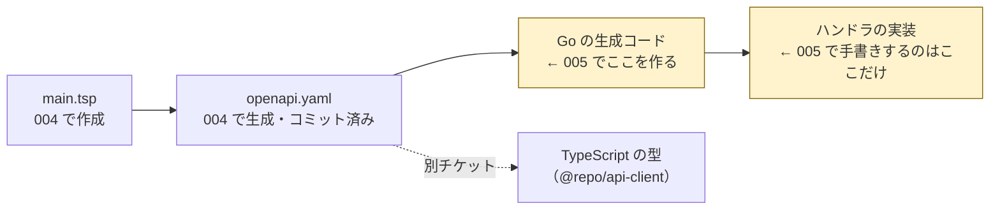
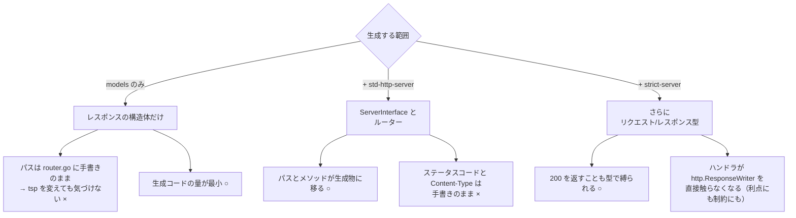
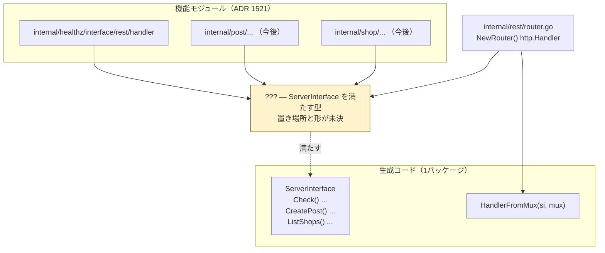
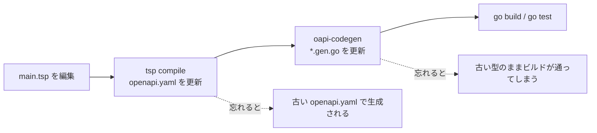

# 005: 生成された型から `/healthz` を TDD で実装し、`/ping` を捨てる

- ステータス: 未着手（**着手可能**）
- 見積: 3h / 実績: -h
- 依存: **004（実質完了・残タスクあり）** — `packages/api-spec` から `openapi.yaml` が生成・コミットされている前提。**未完了の3点は下の「004 からの持ち越し」を参照**
- 関連: [ADR 20260812-0659 Go採用と TypeSpec 起点の契約](../adr/20260812-0659-backend-go-openapi-contract.md)、[ADR 20260815-1521 Go の内部構成](../adr/20260815-1521-go-layered-architecture.md)、[ADR 20260815-1548 ルーターは標準の ServeMux](../adr/20260815-1548-router-stdlib-servemux.md)、[ADR 20260815-2314 ビルド成果物と turbo タスク](../adr/20260815-2314-go-build-output-and-turbo-tasks.md)、[ADR 20260815-2315 ルーターの置き場所](../adr/20260815-2315-router-placement.md)、[ADR 20260812-1324 バージョン固定と audit](../adr/20260812-1324-version-pinning-and-audit.md)、[CLAUDE.md の制約「API 契約の単一情報源は TypeSpec」](../../CLAUDE.md)

- 本チケットで生まれた ADR: [20260823-1423 OpenAPI の出力先](../adr/20260823-1423-openapi-output-location.md)、[20260823-1453 OpenAPI → Go の生成](../adr/20260823-1453-openapi-to-go-codegen.md)

## 1. 目的

004 で生成した `openapi.yaml` から **Go のサーバーコードを生成**し、その型を使って `/healthz` を実装する。手書きの `/ping` を削除し、**HTTP のパスとレスポンスの形が `main.tsp` にしか書かれていない**状態にする。

## 2. 背景

[ADR 20260812-0659](../adr/20260812-0659-backend-go-openapi-contract.md) が定めたパイプラインのうち、004 までで前半が通った。**005 は後半（Go 側）を繋ぐ**。



読み取ってほしいのは3点。

1. **005 で手書きするのは右端だけ。** パス・HTTP メソッド・レスポンスの構造はすべて生成物が持つ
2. **TypeScript 側（`@repo/api-client`）は 005 の範囲外。** スキャフォールドのゴールは「本番URLの `/healthz` が 200 を返す」であり、フロントは通らない。`apps/web` にはまだコードが1行も無い
3. **`/ping` はここで役目を終える。** 003 で手書きしたものが契約駆動に置き換わる過程そのもの（[チケット 003](./003-go-api-skeleton.md) の背景）

### なぜ「型を生成する」だけでなく「ルーティングも生成する」かが論点になるのか

契約が守られる範囲は、**生成物がどこまでを担うか**で決まる。型だけを生成してルーティングを手で書けば、`main.tsp` のパスを変えても Go はコンパイルエラーにならない——**壊れたことが実行時まで分からない**。この線引きが本チケット最大の設計判断で、後述する。

## 3. 事前調査

### 004 の結果として、いま在るもの（実測）

```text
packages/api-spec/
├── main.tsp                                       ← /healthz の契約
├── package.json                                   ← gen スクリプトを持つ
└── tsp-output/@typespec/openapi3/openapi.yaml     ← 生成物。コミット済み
```

```jsonc
// packages/api-spec/package.json（現状）
{
  "scripts": {
    "build": "mkdir -p dist && echo built > dist/out.txt", // ← 002 のダミーのまま
    "gen": "tsp compile . --emit=@typespec/openapi3",      // ← 生成はこちら
  },
}
```

```jsonc
// package.json（ルート・現状）
{
  "scripts": {
    "gen-oa": "pnpm --filter @repo/api-spec gen", // ← 生成は turbo を経由しない
  },
}
```

生成された `openapi.yaml` の中身（全文）。

```yaml
openapi: 3.0.0
info:
  title: Copan API
  version: 0.0.0
paths:
  /healthz:
    get:
      operationId: Health_check
      responses:
        '200':
          description: The request has succeeded.
          content:
            application/json:
              schema:
                $ref: '#/components/schemas/HealthResponse'
components:
  schemas:
    HealthResponse:
      type: object
      required: [status]
      properties:
        version: { type: string }
        status: { type: string, enum: [OK] }
```

`apps/api` 側は 003 のまま。`internal/rest/router.go` が `GET /ping` を1本登録し、`cmd/local` と `cmd/lambda` がそれを共有している。

#### 004 からの持ち越し（着手前に片付けるか、005 の ADR に畳むか決める）

[チケット 004](./004-typespec-openapi-health.md) の完了条件のうち、**3点が未達のまま**である。

| 未達の項目 | 現状 |
| --- | --- |
| 出力先とコミット方針の ADR | **未作成。** 実装は「既定の `tsp-output/` に出してコミットする」形（A〜D のどれとも違う、第5の案）で動いている |
| `packages/api-spec` の `build` を実際の生成に差し替える | ダミーのまま。生成は `gen` / `gen-oa` から手動で回す形 |
| `docs/tickets/README.md` の 004 のステータス | 「着手可能」のまま |

**このうち2番目は 005 と同じ問いである。** 005 でも「OpenAPI → Go の生成をどのコマンドで回すか」を決めることになるため、**生成タスク全体の回し方を1本の ADR にまとめるほうが筋が通る**。1番目と3番目は事務作業として先に片付ける。

### このチケットの範囲外

寄り道を避けるため明示しておく。

- **TypeScript の型生成（`@repo/api-client`）** — フロントを書く段階で切る
- **CI での「再生成して差分が出たら失敗」の自動化** — 006。005 では**手元で再生成して差分が出ないことを確認する**ところまで
- **Lambda へのデプロイ** — 007
- **エラーレスポンス（4xx / 5xx）の契約** — `/healthz` に失敗系が無い。エラー表現の設計は投稿機能の前

### 用語

**コードジェネレータ（OpenAPI → Go）**

- **何をするものか**: `openapi.yaml` を読み、Go のソースファイルを書き出すコマンドラインツール。出すのは「レスポンスの構造体」「実装すべきメソッドの集合（`interface`）」「パスとメソッドをそのインターフェースに紐づけるルーター」
- **なぜ要るのか**: 契約を1箇所に置いても、それが**コンパイラに見える形**にならないと守られない。生成によって、契約違反が実行時のバグではなく**ビルドエラー**になる
- **似た仕組みとの違い**: 004 の emitter（`@typespec/openapi3`）と役割は同じ「生成器」だが、**入力が OpenAPI、出力が Go** である点と、**npm ではなく Go のモジュールとして配布される**点が違う。したがってバージョン固定の手段も別系統になる（後述）
- **いつからある仕組みか**: OpenAPI の前身 Swagger の時代（2011年〜）から `swagger-codegen` があり、「スキーマからコードを起こす」発想自体は SOAP の WSDL まで遡る。Go 向けの現行世代は 2018年頃から

**`ServerInterface`（生成される Go の `interface`）**

生成器が出す「**あなたが実装すべきメソッドの一覧**」。各エンドポイントが1メソッドに対応する。この `interface` を満たす型を書かないとコンパイルが通らないため、**契約にあるエンドポイントの実装漏れがビルドエラーになる**。

**`tool` ディレクティブ（`go.mod`）**

- **何をするものか**: そのモジュールが**開発時に使うコマンドラインツール**を `go.mod` に記録する行。`go tool <名前>` で実行できる
- **なぜ要るのか**: Go には長らく「ビルドに使うツールのバージョンを固定する公式の場所」が無く、`tools.go` という**空のインポートだけを書いたダミーファイル**を置く回避策が慣習になっていた。それを言語側に取り込んだもの
- **似た仕組みとの違い**: `devDependencies`（npm）に相当する。`go install` との違いは、**バージョンが `go.mod` / `go.sum` に載って再現性が出る**こと（`go install ...@latest` は実行した時点の最新が入り、記録が残らない）
- **いつからある仕組みか**: Go 1.24（2025年2月）から。本プロジェクトは 1.26.6 なので使える（[ADR 20260815-1420](../adr/20260815-1420-go-version-and-module-path.md)）

**`//go:generate` コメント**

`//go:generate <コマンド>` と書いたソースがあると、`go generate ./...` でそのコマンドがまとめて実行される。**ビルド時には何もしない**（ただのコメントであり、`go build` は無視する）。生成コマンドを「生成物の隣」に書いておくための仕組みで、Go 1.4（2014年）から。

### 生成ツールの選択肢（今日時点で実測）

| ツール | 最新版 | 対応する HTTP の形 | 特徴 |
| --- | --- | --- | --- |
| [`oapi-codegen`](https://github.com/oapi-codegen/oapi-codegen) | **v2.8.0**（2026-07-17） | **標準 `net/http`** / chi / Echo / Gin / Fiber | 利用者が最も多い。v2.8.0 で OpenAPI 3.1 対応。**Go 1.25 以上が必要** |
| [`ogen`](https://github.com/ogen-go/ogen) | **v1.24.0** | 独自（`net/http` ベース） | 生成コードに `interface{}` とリフレクションを使わない。省略可能な項目を `OptString` のような専用型で表す（ポインタを使わない） |

**`ogen` は enum の値を検証するが、`oapi-codegen` は型と定数を生成するだけで検証しない**（[比較スレッド](https://github.com/oapi-codegen/oapi-codegen/discussions/1027)）。`/healthz` では差が出ないが、投稿機能でリクエストボディを受けるようになると効いてくる論点。

> **TypeSpec から Go を直接生成する道は無い。** TypeSpec には C# と JavaScript のサーバー emitter があるが、**`@typespec/http-server-go` は npm に存在しない**（実測: レジストリが 404 を返す）。[ADR 20260812-0659](../adr/20260812-0659-backend-go-openapi-contract.md) が敷いた「OpenAPI を経由する」経路が、今も唯一の経路である。

### 生成範囲の分岐 — どこまでを生成物に任せるか

`oapi-codegen` は生成する内容を設定ファイルで選ぶ。**この選択が「契約が守られる範囲」を決める。**



読み取ってほしいのは3点。

1. **右へ行くほど手書きが減り、契約違反がコンパイルエラーになる範囲が広がる**
2. **`models` のみを選ぶと、[ADR 20260815-2315](../adr/20260815-2315-router-placement.md) が想定した「ルーティングが生成物に置き換わる」形にならない。** 同 ADR は「置き換わる可能性が高い」を前提に `internal/rest/router.go` を切り出している
3. **一番右は「ハンドラが `http` の語彙から切り離される」。** テストの書き方が変わる（`httptest` でルーター越しに叩く形は変わらないが、ハンドラ単体を呼ぶときの引数が変わる）

### 実測 — 何が生成されるか

手元の `openapi.yaml` に対して、実際に `oapi-codegen v2.8.0` を走らせた結果から、**要点だけを抜き出したもの**（定型のエラー型などは省略）。

```yaml
# 使った設定
package: gen
output: server.gen.go
generate:
  models: true
  std-http-server: true
```

```go
// 生成されたもの（抜粋）

const ( OK HealthResponseStatus = "OK" )

func (e HealthResponseStatus) Valid() bool { /* ... */ }

type HealthResponse struct {
	Status  HealthResponseStatus `json:"status"`
	Version *string              `json:"version,omitempty"`
}

type HealthResponseStatus string

// ServerInterface represents all server handlers.
type ServerInterface interface {
	// (GET /healthz)
	HealthCheck(w http.ResponseWriter, r *http.Request)
}

// 渡された mux にルートを登録して返す
func HandlerFromMux(si ServerInterface, m ServeMux) http.Handler
func HandlerWithOptions(si ServerInterface, options StdHTTPServerOptions) http.Handler
```

`strict-server: true` を足すと、上に加えて次が生成される。

```go
type HealthCheckRequestObject struct{}

type HealthCheckResponseObject interface { VisitHealthCheckResponse(w http.ResponseWriter) error }

type HealthCheck200JSONResponse HealthResponse   // ← Content-Type と 200 を自分で書き込む

type StrictServerInterface interface {
	// (GET /healthz)
	HealthCheck(ctx context.Context, request HealthCheckRequestObject) (HealthCheckResponseObject, error)
}

// StrictServerInterface を ServerInterface に変換する
func NewStrictHandler(ssi StrictServerInterface, middlewares []StrictMiddlewareFunc) ServerInterface
```

観測できた事実で、判断に効くもの。

- **`operationId: Health_check` が Go のメソッド名 `HealthCheck` になる。** `_` の前後がそれぞれ大文字化されて連結される。型名は `HealthResponse`（`components.schemas` のキー）
- **必須でない `version` はポインタ（`*string`）、必須の `status` は値**になる
- **enum の定数名が `OK`（パッケージ直下）になった。** 型名を冠さない素の `OK` である。同じ値を持つ enum が別のモデルに現れると衝突するため、そのとき名前が変わる
- **生成コードは標準ライブラリしか import しない**（`bytes` / `context` / `encoding/json` / `fmt` / `net/http`）。パスパラメータやクエリを持つエンドポイントが増えると `github.com/oapi-codegen/runtime` が必要になるが、**`/healthz` の段階では `apps/api` の実行時の依存は1つも増えない**
- 先頭に `//go:build go1.22` が付く。Go 1.22 で `ServeMux` が `"GET /path"` 形式を解するようになったことに依存しているため（[ADR 20260815-1548](../adr/20260815-1548-router-stdlib-servemux.md) が整理した変化そのもの）

### 最大の設計論点 — 「API 全体で1つの `interface`」とモジュール分割をどう噛み合わせるか

生成される `ServerInterface` は **API 全体で1つ**である。一方 [ADR 20260815-1521](../adr/20260815-1521-go-layered-architecture.md) は、ハンドラを**機能モジュールごとのパッケージ**に分けると決めている。`health` に続いて `post` / `shop` が増えると、**1つの `interface` を複数パッケージにまたがって満たす**必要が出る。



読み取ってほしいのは3点。

1. **黄色い箱の中身がこのチケットで決めること。** 「1つの型に全メソッドを書く」「モジュールごとの型を1つに集約する（Go の埋め込みが使える）」など複数の形がありうる
2. **`/healthz` が1本しか無い今は、どの形を選んでも同じ手数で書ける。** 差が出るのは2つ目のモジュールが増えたとき。**今決めておく価値はそこにある**
3. **依存の向きは変わらない。** [ADR 20260815-2315](../adr/20260815-2315-router-placement.md) の「`rest` → 各モジュールの一方通行」はそのまま維持できる

> **これは [ADR 20260815-2315](../adr/20260815-2315-router-placement.md) が「結果として必要になる決定」に残した宿題**（「004 で生成コードが入ったとき、`NewRouter()` がどう変わるか」）の回収にあたる。**ADR を書く対象。**

あわせて **生成コードの置き場所**も決める。[ADR 20260815-1521](../adr/20260815-1521-go-layered-architecture.md) の `internal/{module}/` という規則に対し、生成物は**全モジュール共通で、どのモジュールにも属さない**。同 ADR は `internal/rest` を「モジュールではない例外的なパッケージ」として既に1つ認めており、その扱いを広げるかどうかの判断になる。

### 生成器のバージョンをどこで固定するか

[ADR 20260812-1324](../adr/20260812-1324-version-pinning-and-audit.md) は「バージョンは `mise.toml` に集約し、依存は完全固定する」と定めている。Go のツールにはこれを満たす経路が3つある。

| | 手段 | バージョンの記録先 | 備考 |
| --- | --- | --- | --- |
| A | `go get -tool <path>@<version>` | `apps/api/go.mod` の `tool` 行 + `go.sum` | 実行は `go tool oapi-codegen`。**Go 1.24 以降の公式の場所** |
| B | `mise.toml` の `go:` バックエンド | `mise.toml` | `"go:github.com/..." = "v2.8.0"` と書く。裏で `go install` が走る |
| C | `go install ...@<version>` を手で叩く | どこにも残らない | 再現性が無い。**採らない** |

**A を採ると `apps/api/go.mod` に生成器のビルド依存が入る**（実測: 17個の `// indirect` が増える）。これは実行時の依存ではなくビルド時だけのものだが、`go.mod` の見た目は重くなる。**B なら `go.mod` は汚れないが、バージョンの記録場所が Go の外に出る。** どちらを重く見るかの判断。

> 実測メモ: `go get -tool github.com/oapi-codegen/oapi-codegen/v2/cmd/oapi-codegen@v2.8.0` を空のモジュールで実行すると、`go.mod` に `tool github.com/oapi-codegen/oapi-codegen/v2/cmd/oapi-codegen` の1行と、上記の間接依存が書かれる。

### turbo にどう載せるか

現状、生成は turbo を通らない（ルートの `gen-oa` を手で叩く）。005 で **2段目の生成**（OpenAPI → Go）が増えると、順序の問題が表面化する。



読み取ってほしいのは2点。

1. **手動で回す限り、順序を守るのは人間の責任になる。** 生成物をコミットする方式なので、**忘れても壊れずに古いまま通る**——これが最も見つけにくい壊れ方
2. **turbo の `dependsOn` に載せれば順序が保証される。** `@repo/api` は `@repo/api-spec` を `devDependencies` に持つため、`build` に載せるだけで「api-spec が先」は自動的に決まる（003 で確認済み）

決めることは2つ。**どのタスク名で回すか**（`build` / `generate` の新設）と、**turbo にそもそも載せるか**（手動のままにして 006 の CI で検知する道もある）。004 の持ち越しと同じ問いなので、**まとめて1本の ADR にする**。

### `operationId` とパス（**ステップ2で決定済み**）

当初は `op check()` で、Go のメソッド名が `Check` になっていた。`ServerInterface` は API 全体で1つなので、`CreatePost` / `ListShops` と並んだときに何の `Check` か分からなくなる。

TypeSpec の `interface` で操作をまとめる形に変え、あわせてパスを `/healthz` にした。

```tsp
@route("/healthz")
interface Health {
  @get check(): HealthResponse;
}
```

書き方による違いは実測で確認した。

| `main.tsp` の書き方 | `operationId` | Go のメソッド名 |
| --- | --- | --- |
| `op check()` | `check` | `Check` |
| `op checkHealth()` | `checkHealth` | `CheckHealth` |
| **`interface Health { @get check() }`** | **`Health_check`** | **`HealthCheck`** |
| `namespace Ops { @get op check() }` | `Ops_check` | `OpsCheck` |

**`interface` を選んだ理由**: gRPC の Health Checking Protocol が `Health` サービスの `Check` メソッドという形を採っており、それと同じ構造になる。`namespace` でも同じ接頭辞が付くが、`namespace` は「名前の衝突を避ける区画」、`interface` は「サービスが提供する操作の集合」という意味の違いがある。

**`/healthz` にした理由**: Google 社内の z-pages（`/varz` / `/statusz` / `/healthz` / `/rpcz`）の慣習に合わせた。Kubernetes の `/healthz` `/livez` `/readyz` も同じ系統。

> **`main.tsp` が単一情報源である。** `openapi.yaml` を手で編集して名前を変えない。

## 4. 学習TODO

- [ ] **生成コードが「実装すべき `interface`」と「ルーター」に分かれている理由**を説明できる。分かれていることで何が守られるか
- [ ] **`main.tsp` のパスを変えたとき、何がどの段階で壊れるか**を、生成範囲（`models` のみ / `std-http-server` あり）ごとに説明できる
- [ ] **`go.mod` の `tool` ディレクティブが何をするものか**を説明できる。`go install` や npm の `devDependencies` との違いも
- [ ] **生成コードをコミットする理由**を説明できる。コミットしない場合に何が面倒になるか（[CLAUDE.md の制約](../../CLAUDE.md)）
- [ ] **必須でない項目が `*string` になる理由**と、それを扱うときに気をつけること（nil 参照）を説明できる
- [ ] **turbo が「別パッケージのファイルが変わったこと」をどう知るか**を、003 の学習TODO（ハッシュの材料）と結びつけて説明できる
- [ ] **`//go:build go1.22` が生成コードに付いた理由**を、[ADR 20260815-1548](../adr/20260815-1548-router-stdlib-servemux.md) と結びつけて説明できる

## 5. 不足情報TODO

1〜5 は互いに絡むため1本の ADR にまとめた。すべて [ADR 20260823-1453](../adr/20260823-1453-openapi-to-go-codegen.md) で決着した。

- [x] ~~**生成ツールを決める**~~ → **`oapi-codegen` v2.8.0**（被 import 数 1,674 対 59 の実測差）。**あわせて Gin は不採用で確定**（[ADR 20260815-1548](../adr/20260815-1548-router-stdlib-servemux.md) の宿題を回収）
- [x] ~~**生成する範囲を決める**~~ → **`models` + `std-http-server` + `strict-server`**
- [x] ~~**生成コードの置き場所と、`ServerInterface` をモジュール分割とどう噛み合わせるか**~~ → **`apps/api/internal/rest/gen/`**（`package gen`）。`internal/rest/server.go` の集約 struct が各モジュールを**埋め込んで** `StrictServerInterface` を満たす（[ADR 20260815-2315](../adr/20260815-2315-router-placement.md) の宿題を回収）
- [x] ~~**生成器のバージョン固定の手段**~~ → **`apps/api/go.mod` の `tool` ディレクティブ**（`go get -tool ...@v2.8.0`）
- [x] ~~**生成コマンドを turbo のどのタスクに載せるか**~~ → **各パッケージの `build` スクリプトに含める。`turbo.jsonc` は変更しない**（004 からの持ち越しを解消）
- [x] ~~**`operationId` を `check` のままにするか**~~ → **`interface Health` にまとめ、パスも `/healthz` に変更**。`operationId` は `Health_check`、Go のメソッド名は `HealthCheck`（ステップ2で決定）
- [x] ~~**`HealthResponse.version` を返すか**~~ → **v0.1 の間は返さない（`nil` のまま）**。契約上 `version` は省略可能で、いま返しても判別に使える値（デプロイ済みの版）にならないため。ビルド時に埋める案は、必要になった時点で別チケットにする（ステップ6で決定）
- [ ] **004 の残タスクを片付ける** → 出力先の ADR（[20260823-1423](../adr/20260823-1423-openapi-output-location.md)）と一覧の更新は完了。**残るのは 004 の学習TODO と振り返り（本人が記入）**

## 6. 実装ステップ

1. ~~**004 の残りを片付ける**~~ → [ADR 20260823-1423](../adr/20260823-1423-openapi-output-location.md) を作成済み。**004 の学習TODO と振り返りは本人が記入する分が残っている**
2. ~~**`operationId` を決める**~~ → `interface Health` + `/healthz` に変更し、`pnpm gen-oa` で再生成済み
3. ~~**生成ツールと生成範囲を決める**~~ → [ADR 20260823-1453](../adr/20260823-1453-openapi-to-go-codegen.md) を作成済み
4. **ツールを入れてバージョンを固定する。** 決めた手段（A / B）で入れ、実行できることを確認する
5. **設定ファイルを書いて生成する。** 生成物を目視し、下の「生成物の検証観点」を確認する
6. **失敗するテスト**: `/healthz` に GET したら 200 と期待するボディが返ることを `httptest` で検証する。実装が無いので落ちる（**`/ping` のテストはこの時点では残す**）
7. **通す**: 生成された `interface` を満たす型を実装し、`internal/rest/router.go` を生成コード経由に差し替える
8. **`/ping` を捨てる**: ハンドラ・ルート・テストを削除する。**`internal/healthz/interface/rest/handler` が空にならないよう**、`/healthz` の実装がこの層に載っていることを確認する
9. **ローカルで確認**: `go run ./cmd/local` を起動し、`curl` で `/healthz` と、消えた `/ping` の両方を叩く
10. **turbo に載せる**（不足情報TODO の5の決定を反映）。生成物をコミットする
11. **再生成して差分が出ないことを確認する**（006 の CI がやることを手で1回やる）

### テスト観点

- 正常系: `/healthz` が 200 を返す
- レスポンスの `Content-Type` が `application/json` か（**生成範囲によって、これを誰が書き込むかが変わる**）
- ボディが契約どおりか（`status` が `"OK"`、`version` を返す判断をしたならその扱い）
- **`/ping` が 404 になる**（消し忘れの検出）
- 未定義のパスが 404 を返す
- `/healthz` に **POST** したときの挙動（`ServeMux` は登録済みパスへのメソッド違いをどう扱うか）
- ローカル用と Lambda 用が**同一のハンドラ**を指している（003 から引き継ぐ観点）
- **生成コードそのもののテストは書かない。** どこまでを「生成器を信頼する境界」にするかを意識する

### 生成物の検証観点

- `ServerInterface`（相当のもの）に `/healthz` のメソッドが1つだけ生えているか
- レスポンスの構造体が `openapi.yaml` の `HealthResponse` と一致しているか（必須・省略可能の別を含めて）
- ルーティングの登録が `GET /healthz` になっているか
- 生成コードが `apps/api` の**実行時の依存**を増やしていないか
- 生成ファイルの先頭に「編集するな」の趣旨のコメントがあるか（手で触らない境界の目印）

## 7. 完了条件

- [ ] `go test ./...` が通る
- [ ] `go run ./cmd/local` で起動し、`curl -i localhost:8081/healthz` が **200** と `Content-Type: application/json`、契約どおりのボディを返す
- [ ] `curl -i localhost:8081/ping` が **404** を返す（手書きのエンドポイントが残っていない）
- [ ] `go build ./cmd/lambda` が成功する
- [ ] `grep -r '"/healthz"' apps/api --include='*.go'` の結果が、**生成ファイルの中だけ**に収まっている（パスが手書きで残っていない）
- [ ] 生成コマンドをもう一度実行しても `git status` に差分が出ない（生成が冪等である）
- [ ] `openapi.yaml` と生成された Go ファイルを**手で編集していない**（`main.tsp` だけが情報源になっている）
- [ ] 生成された Go ファイルがコミット対象に入っている（`.gitignore` と整合している）
- [ ] ルートから `pnpm exec turbo run build` と `pnpm exec turbo run test` が成功する
- [ ] 生成器のバージョンが、決めた場所に**固定値として**記録されている（`latest` になっていない）
- [ ] 決定が ADR に残り、`docs/adr/README.md` の一覧と `docs/tech-decision-guide.md`「5. 決定済みの事項」が更新されている
- [ ] `docs/tickets/README.md` の 004 と 005 のステータスが更新されている
- [ ] 学習TODOがすべて埋まっている
- [ ] 不足情報TODOがすべて解消（またはADR化）されている

## 8. 振り返り（完了時に本人が記入）

- 詰まった点:
- 分かったこと:
- 見積とのズレと、その原因:
