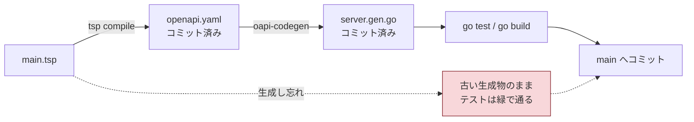
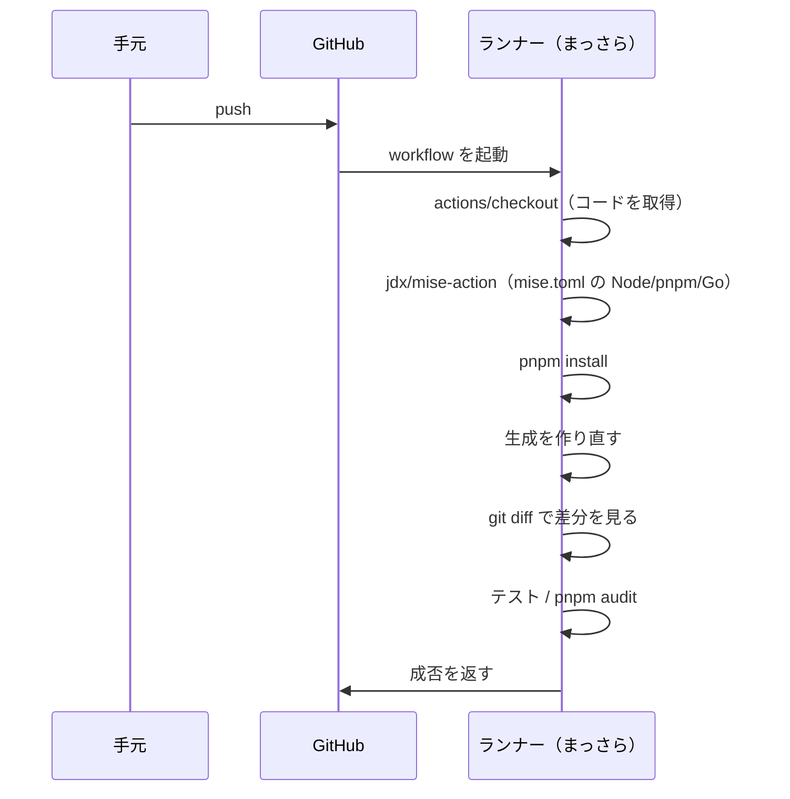
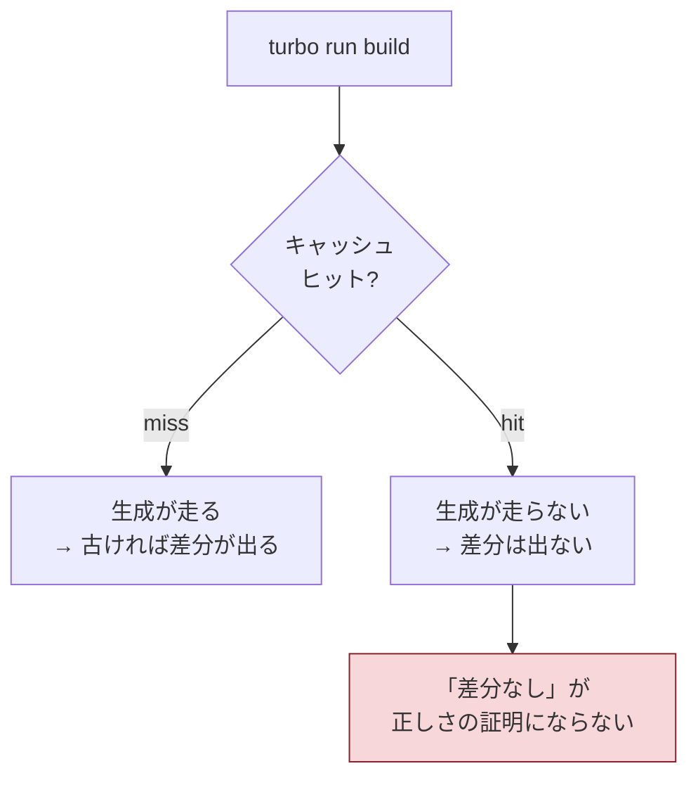

# 006: CI を組み、テストと「生成物の作り直し差分」を機械に検証させる

- ステータス: **進行中**（ステップ9 完了 / 2026-08-30。残りはステップ10 と、本人による学習TODO・振り返りの記入）
- 見積: 3h / 実績: -h
- 依存: **005 のステップ10「生成を `build` スクリプトに載せる」** → **2026-08-30 に完了**。`packages/api-spec` の `build` が `tsp compile`、`apps/api` の `build` が `go tool oapi-codegen` を前置する形になり、`pnpm exec turbo run build --force` で両方が作り直されて差分が出ないことを確認済み
- 関連: [ADR 20260812-0659 型共有は TypeSpec 起点](../adr/20260812-0659-backend-go-openapi-contract.md)、[ADR 20260812-1324 バージョン固定と audit](../adr/20260812-1324-version-pinning-and-audit.md)、[ADR 20260812-0905 開発ワークフロー](../adr/20260812-0905-development-workflow.md)、[ADR 20260815-1420 Go のバージョン](../adr/20260815-1420-go-version-and-module-path.md)、[ADR 20260815-1906 Lambda アダプタ](../adr/20260815-1906-lambda-adapter-and-runtime.md)、[ADR 20260815-2314 ビルド成果物と turbo タスク](../adr/20260815-2314-go-build-output-and-turbo-tasks.md)、[ADR 20260823-1423 OpenAPI の出力先](../adr/20260823-1423-openapi-output-location.md)、[ADR 20260823-1453 OpenAPI → Go の生成](../adr/20260823-1453-openapi-to-go-codegen.md)、[技術選定ガイド G-6](../tech-decision-guide.md)

- 本チケットで生まれた ADR: [20260830-1435 CI は GitHub Actions の1ジョブ](../adr/20260830-1435-ci-github-actions.md)、[20260830-1625 public 化とルールセット](../adr/20260830-1625-public-repository-and-branch-ruleset.md)

## 1. 目的

**main に入る前に、人間ではなく機械が次の3つを毎回検証する状態を作る。**

1. Go のテストが通る
2. **生成物を作り直したとき、コミット済みのものと差分が出ない**（`main.tsp` だけが契約の情報源であることの担保）
3. Node の依存に high 以上の脆弱性が無い

これを動かす前提として、**リモートリポジトリを作る**ところまでが本チケットの範囲。

## 2. 背景

### 「人間の責任」として先送りしてきたものが、ここに全部集まっている

004 と 005 の ADR は、同じ穴を繰り返し 006 に預けている。

| どこで                                                             | 何を預けたか                                                                                                                       |
| ------------------------------------------------------------------ | ---------------------------------------------------------------------------------------------------------------------------------- |
| [CLAUDE.md の制約](../../CLAUDE.md)                                | 「生成物はコミットし、**CI で再生成して差分が出たら失敗させる**」                                                                  |
| [20260823-1423](../adr/20260823-1423-openapi-output-location.md)   | 「生成し忘れると、古い `openapi.yaml` のまま通る。**006 の CI が入るまでは人間の責任**」                                           |
| [20260823-1453](../adr/20260823-1453-openapi-to-go-codegen.md)     | 「`turbo run test` は生成を待たない。**006 の CI が塞ぐまでは人間の責任**」                                                        |
| [20260812-1324](../adr/20260812-1324-version-pinning-and-audit.md) | 「`pnpm audit` を CI のジョブとして組み込む具体は**チケット 006**」                                                                |
| [20260812-0905](../adr/20260812-0905-development-workflow.md)      | 「チケットとブランチ・PR の対応づけ（**CI 構築時**）」「GitHub Issues へ移行するか（**リモートリポジトリを作成するタイミング**）」 |

いま何が守られていないかを図にする。



読み取ってほしいのは3点。

1. **点線の経路が、今日いつでも起きうる。** 生成物をコミットする方式（[20260823-1423](../adr/20260823-1423-openapi-output-location.md)）を選んだ代償であり、選択そのものは正しい
2. **点線を通っても、テストは緑になる。** 契約とコードが揃っているかは、テストが見ている情報ではない。**「作り直して差分が出ないこと」でしか検出できない**
3. **見つかるのは、フロント（`@repo/api-client`）が古い型を使い始めたとき**——つまり、ずっと後で、原因から遠い場所で見つかる

### リモートリポジトリがまだ無い

実測: `git remote -v` の出力が空。ローカルの `main` に9コミットが積まれているだけの状態。CI はリモートで走るものなので、**リポジトリの作成が最初のステップになる**。あわせて [20260812-0905](../adr/20260812-0905-development-workflow.md) が「リモートを作る段階で再検討する」と保留した **GitHub Issues への移行**も、判断のタイミングがここに来る。

## 3. 事前調査

### 3.1 用語 — GitHub Actions の語彙

初出の語をすべて説明する。以降の節はこの語で書く。

| 語                           | 何をするものか                                                                                       | なぜ要るのか / 似た仕組みとの違い                                                                                                                                                      |
| ---------------------------- | ---------------------------------------------------------------------------------------------------- | -------------------------------------------------------------------------------------------------------------------------------------------------------------------------------------- |
| **workflow**（ワークフロー） | 「いつ・何を走らせるか」を書いた YAML ファイル1枚。置き場は `.github/workflows/*.yml` と決まっている | **CI の設定がリポジトリに同居する**のが特徴。Jenkins のようにサーバー側に設定を持つ方式と違い、設定変更が普通の差分としてレビューできる。GitHub Actions は 2019 年に一般提供が始まった |
| **runner**（ランナー）       | ジョブを実行する使い捨ての仮想マシン。`runs-on: ubuntu-24.04` のように指定する                       | **毎回まっさらな状態で起動する。** リポジトリのファイルすら入っていない。これが次の `actions/checkout` が必要な理由そのもの                                                            |
| **job**（ジョブ）            | 1台のランナー上で順に実行される step の集まり                                                        | **ジョブどうしは既定で並列に走り、別のマシンで動く。** ファイルもインストール済みのツールも共有されない。分けると速いが、分けた数だけセットアップ（mise / pnpm install）を繰り返す     |
| **step**（ステップ）         | ジョブの中の1手順。`run:`（シェルコマンド）か `uses:`（後述の action）のどちらか                     | ステップは同じランナー上で順に走るので、**ファイルもカレントディレクトリの状態も引き継がれる**                                                                                         |
| **action**（アクション）     | ステップから呼べる再利用可能な部品。`uses: owner/repo@ref` の形で参照する                            | npm のパッケージに相当する。`ref` はタグかコミット SHA。**`@main` のような可動の参照を書くと、他人のリポジトリの変更が自分の CI に無断で入る**                                         |
| **trigger**（`on:`）         | ワークフローを起動するイベント。`push` / `pull_request` など                                         | 「いつ検証するか」の設計判断そのもの。3.6 で扱う                                                                                                                                       |
| **`GITHUB_TOKEN`**           | ワークフロー実行ごとに自動発行される、そのリポジトリ向けの一時的な認証情報                           | 事前にシークレットを登録しなくても、API を叩ける。権限は `permissions:` で絞れる                                                                                                       |

### 3.2 いま在るもの（実測）

CI が叩くことになるコマンドは、すべてローカルに既に在る。

| パッケージ         | `build`                                                                                                                           | `test`                       |
| ------------------ | --------------------------------------------------------------------------------------------------------------------------------- | ---------------------------- |
| `@repo/api-spec`   | **ダミー**（`mkdir -p dist && echo built > dist/out.txt`）。生成は別スクリプト `gen`（`tsp compile . --emit=@typespec/openapi3`） | 無し                         |
| `@repo/api`        | `mkdir -p dist && GOOS=linux GOARCH=arm64 go build -o dist/bootstrap ./cmd/lambda`                                                | `go test ./...`              |
| `@repo/api-client` | ダミー                                                                                                                            | `echo test @repo/api-client` |
| `@repo/web`        | ダミー                                                                                                                            | `echo test @repo/web`        |

```jsonc
// turbo.jsonc（現状）
{
  "tasks": {
    "build": { "dependsOn": ["^build", "^test"], "outputs": ["dist/**"] },
    "test": {},
  },
}
```

コミット済みの生成物は2つ。

```text
packages/api-spec/tsp-output/@typespec/openapi3/openapi.yaml   ← 1段目の生成物
apps/api/internal/rest/gen/server.gen.go                       ← 2段目の生成物
```

**依存の欄に書いたとおり、生成は `build` に載っていない。** 005 のステップ10が入れば `pnpm exec turbo run build` の1コマンドで両方が作り直される。入るまでは、CI が生成を明示的に叩くしかない（`pnpm gen-oa` と `go tool oapi-codegen -config oapi-codegen.yaml ../../packages/api-spec/tsp-output/@typespec/openapi3/openapi.yaml`）。**どちらの形で書くかで、CI の寿命が変わる**——前者なら生成が増えても CI は変わらない。

### 3.3 1回の push で何が起きるか



読み取ってほしいのは3点。

1. **ランナーには何も無い状態から始まる。** `node_modules/` も `dist/` も `.turbo/` も無い。これは 002 で踏んだ「ローカルでは `dist/` が残っているので気づけない」壊れ方（[チケット 002](./002-monorepo-scaffold.md)）を、CI が構造的に検出してくれるということでもある
2. **`git diff` を見る時点で、作業ディレクトリは「チェックアウトした状態＋作り直した生成物」になっている。** 差分が出る＝コミットされた生成物が古い
3. **この並びを1ジョブに収めるか分けるかは未決**（3.6）。分ければ並列で速いが、`checkout` と `mise` と `pnpm install` を分けた数だけ繰り返す

### 3.4 差分の見方 — `git diff` と `git status` は見ているものが違う

作り直したあとに「差分が出たら失敗させる」の書き方は2通りある。**どちらを選ぶかで、検出できない壊れ方が変わる。**

| 書き方                   | 検出するもの                                                                           | 検出しないもの                                                                                            |
| ------------------------ | -------------------------------------------------------------------------------------- | --------------------------------------------------------------------------------------------------------- |
| `git diff --exit-code`   | **追跡済み**ファイルの変更。差分があれば終了コード 1、内容もログに出る                 | **追跡外（新規）のファイル。** 生成器が新しいファイルを吐いた場合、コミットし忘れても気づけない           |
| `git status --porcelain` | 追跡外のファイルも含めた作業ディレクトリ全体の状態を、機械可読な1行1ファイル形式で出す | 何も出なければ空文字列を返すだけ。**終了コードは常に 0 なので、空かどうかを自分で判定するステップが要る** |

いまの構成では2段目の生成物は `server.gen.go` の1ファイルに集約されるが、**1段目（`tsp compile`）は emitter の設定と契約の書き方でファイルが増えうる**。「新しいファイルが増えた」を検出したいかどうかが選択の分かれ目になる。

### 3.5 turbo のキャッシュと差分チェックは、噛み合わせを間違えると無意味になる

**本チケットで最も見落としやすい点。** turbo のキャッシュヒットは「タスクを**実行しない**」ことを意味する。生成を `build` に載せた場合、キャッシュヒットした build は**生成を走らせない**。



読み取ってほしいのは3点。

1. **いまは事故が起きない。** ランナーは毎回まっさらで `.turbo/` を持たないため、必ず miss して実行される
2. **リモートキャッシュを入れた瞬間に、右の経路が現実になる。** ハッシュの材料にはパッケージ内のファイル（`openapi.yaml` や `server.gen.go` 自身）も含まれるので大半のズレは miss になるが、「`main.tsp` を直して `turbo run build` を回し、生成物を含めずにコミットした」という組み合わせは**過去に一度キャッシュされている**——CI ではそれがヒットして素通りする
3. **`outputs` に生成物が入っていないことが効いている。** [20260815-2314](../adr/20260815-2314-go-build-output-and-turbo-tasks.md) の `outputs: ["dist/**"]` は生成物を含まないため、ヒット時に復元もされない

対策は「差分チェックのときだけ `--force` を付ける」か「生成だけ turbo を通さず直接叩く」。**リモートキャッシュを使わない選択をするなら、いまは何もしなくてよい**——ただしその判断は ADR に残す（3.6 の 6）。

### 3.6 決める必要があること（詳細は「5. 不足情報TODO」）

CI の形は、**リポジトリの公開範囲 → トリガ → ジョブ構成 → 差分チェックの書き方**の順に決まる。上流を変えると下流が全部変わるので、順に決める。

### 3.7 使う部品のバージョン（実測: 2026-08-23 時点の最新）

| action             | 最新                     | 用途                                                                          |
| ------------------ | ------------------------ | ----------------------------------------------------------------------------- |
| `actions/checkout` | **v7.0.1**（2026-07-20） | まっさらなランナーにリポジトリを持ってくる                                    |
| `jdx/mise-action`  | **v4.2.5**（2026-08-13） | `mise.toml` に書かれた Node / pnpm / Go を入れる                              |
| `actions/cache`    | **v6.1.0**（2026-06-26） | 任意のディレクトリをキャッシュする。Go のモジュールキャッシュを載せるなら使う |

`jdx/mise-action` の主な入力（実測、既定値）:

| 入力                | 既定      | 意味                                                                                         |
| ------------------- | --------- | -------------------------------------------------------------------------------------------- |
| `version`           | `latest`  | 入れる **mise 本体**のバージョン。`mise.toml` が決めるのはツール側であって mise 自身ではない |
| `install`           | `true`    | `mise install` を実行する                                                                    |
| `cache`             | `true`    | 入れたツールを GitHub のキャッシュに保存する                                                 |
| `cache_key_prefix`  | `mise-v1` | キャッシュキーの接頭辞                                                                       |
| `working_directory` | `.`       | どこの `mise.toml` を読むか                                                                  |

**`actions/setup-go` は使わない。** [20260815-1420](../adr/20260815-1420-go-version-and-module-path.md) が「バージョンの真実が2箇所に分かれるため避ける」と決めている。その代償として、`setup-go` が既定でやってくれていた **Go のモジュールキャッシュ（`~/go/pkg/mod`）とビルドキャッシュ（`~/.cache/go-build`）が効かない**。要るなら `actions/cache` で自分で載せる——ただし現在の依存量なら効果は数十秒で、**まず載せずに実測してから判断してよい**。

### 3.8 ワークフローファイルの骨組み

**構文は具体的に示す。何をどの順で並べるかは空欄にする**（[ADR 20260812-0905](../adr/20260812-0905-development-workflow.md)）。

```yaml
# .github/workflows/ci.yml
name: CI

on:
  # TODO: どのイベントで走らせるか（不足情報TODO 3）
  #   push:         { branches: [main] }
  #   pull_request: { branches: [main] }

permissions:
  contents: read # 既定より狭める。mise-action は API のレート制限回避に GITHUB_TOKEN を使う

jobs:
  # TODO: ジョブをいくつに分けるか（不足情報TODO 4）
  <ジョブID>:
    runs-on: ubuntu-24.04 # ubuntu-latest は中身が予告付きで入れ替わる。固定するかは判断
    steps:
      - uses: actions/checkout@v7.0.1
      - uses: jdx/mise-action@v4.2.5
      # TODO: ここから先（pnpm install / 生成の作り直し / 差分チェック / テスト / audit）
      #       を、どの順で、いくつのステップに分けて書くか
```

構文のうち押さえておくもの:

- **`run:`** はランナーの既定シェル（Linux なら bash）でコマンドを実行する。**終了コードが 0 以外ならそのステップが失敗**し、以降のステップは既定で実行されない
- **`working-directory:`** をステップに書くと、そのステップだけ実行場所を変えられる（`apps/api` で `go tool` を叩く場合など）
- **`|`** で複数行のシェルを1ステップに書ける
- **`name:`** をステップに付けると、GitHub の画面でその名前が見出しになる。**失敗したときに原因の切り分けが速くなるので、ステップの粒度は「1ステップ＝1つの検証」に寄せる価値がある**

pnpm について1点: **CI では `pnpm install` の `--frozen-lockfile` が既定で有効**（`CI` 環境変数が立っているため）。`pnpm-lock.yaml` と `package.json` が食い違っていれば、その時点で失敗する。[20260812-1324](../adr/20260812-1324-version-pinning-and-audit.md) の「依存を完全固定する」がここで効く。

### 3.9 課金（判断材料）

|                        | 標準ランナーの料金                          |
| ---------------------- | ------------------------------------------- |
| **public リポジトリ**  | 無料（無制限）                              |
| **private リポジトリ** | GitHub Free プランで**月 2,000 分**まで無料 |

いまのビルド規模なら 1 回 2〜3 分程度に収まる見込みで、private でも上限には遠い。**公開範囲は課金ではなく別の理由で決めることになる**（不足情報TODO 1）。

## 4. 学習TODO

- [x] **workflow / job / step / runner / action** をそれぞれ説明できる。とくに**ジョブを分けると何が共有されなくなるか**
  - workflow は「いつ・何を走らせるか」を書いた定義で、`.github/workflows/*.yml` の1枚。job はその workflow の中で、1台の runner 上を流れる step のまとまり。step は最小の処理単位で、`run:`（シェルコマンド）か `uses:`（action）のどちらか。runner は毎回まっさらな状態で起動する使い捨ての仮想マシン。action は step から呼べる再利用可能な部品で、`uses: owner/repo@ref` で参照する
  - **job どうしは既定で並列に走り、それぞれ別の runner で動く。** 定義した順に流れるわけではなく、順序をつけたいときは `needs:` を書く。step のほうは同じ runner 上を必ず順に流れる
  - **ジョブを分けると、ファイルとインストール済みツールが共有されなくなる。** checkout の結果も `node_modules/` も生成物も引き継がれないため、分けた数だけ checkout / mise / `pnpm install` を繰り返すことになる。本チケットで1ジョブに収めたのはこれが理由（[ADR 20260830-1435](../adr/20260830-1435-ci-github-actions.md) の決定4・理由4）

- [x] **`actions/checkout` を明示的に書く必要がある理由**を、ランナーの性質から説明できる
  - ランナーはまっさらなマシンなので、git 管理されている内容をダウンロードしないといけない
  - しかも実体は `git clone` なので、**`.git` ごと持ってくる**。これがあるおかげでランナー上で `git status` / `git diff` が使え、差分チェックが成立している

- [x] **生成物をコミットする方式において、CI の差分チェックが何を守っているか**を説明できる。**守れないものは何か**も
  - ローカルでの生成漏れをチェックし守っている。内容の正しさまでは見られない
  - 言い換えると、守っているのは `main.tsp` と生成物の**一貫性**であって、契約そのものの**正しさ**ではない。`main.tsp` と生成物が揃ってさえいれば、契約が間違っていても緑になる

- [x] **turbo のキャッシュヒットが「タスクを実行しない」ことの意味**を、`outputs` に入っていない生成物がどうなるかと結びつけて説明できる（003・005 の学習TODO「ハッシュの材料」の続き）
  - キャッシュがある場合は、そのキャッシュを使い回せばよい。タスクはこのキャッシュを作る作業なのだから、タスクは実行しないでよい
  - **`outputs` は「キャッシュに保存する対象」の指定。** そこに入っていない生成物は保存されず、**ヒット時に復元もされない**
  - **このときエラーにはならない。** 生成が走らず復元もされないので、checkout 直後の「古い生成物」がそのまま残り、`git status` は空になって**緑で通る**。壊れているのに赤くならないのが怖い点で、`--force` を付けたのはこれを塞ぐため（[ADR 20260830-1435](../adr/20260830-1435-ci-github-actions.md) の決定6）
  - なお `outputs` に何も出ないタスクは `no output files found for task` という**警告**が出るだけで、失敗はしない

- [x] **`git diff --exit-code` と `git status --porcelain` の違い**を、検出できない壊れ方の違いとして説明できる
  - `git diff` は具体的な行の変更内容を出し、`git status` はどのファイルに変更があるかを出す
  - **検出できない壊れ方の違いは「追跡外のファイル」。** `git diff --exit-code` は**追跡済みファイルの変更しか見ない**ため、生成器が新しいファイルを吐いたときのコミット忘れを見逃す。`git status --porcelain` は追跡外も拾うのでこれを検出できる
  - 代償として `--porcelain` は**終了コードが常に 0** なので、出力が空かどうかを判定する行を自分で書く必要がある。差分の中身は出ないため、失敗時に `git diff` を併記して見せている

- [x] **`jdx/mise-action` が `mise.toml` を読むことで、ローカルと CI のバージョンが一致する仕組み**を説明できる。`actions/setup-go` を併用しない理由も
  - ローカルも CI も同じ `mise.toml` を読んでいるから一致する。`setup-go` を使わなくても mise 側で Go を管理している
  - **併用しないのは「不要だから」ではなく、害があるから。** バージョンの真実が `mise.toml` とワークフローの2箇所に分かれると、**片方だけ直しても両方が正常終了してしまい、ズレに気づけない**（[ADR 20260815-1420](../adr/20260815-1420-go-version-and-module-path.md)）
  - 代償として、`setup-go` が既定でやってくれる Go のモジュールキャッシュ・ビルドキャッシュが効かない。要るなら `actions/cache` で自分で載せる

- [x] **`pnpm audit --audit-level=high` が失敗する条件**と、**自分のコードを1行も変えていないのに赤くなったときにどうするか**を説明できる（[20260812-1324](../adr/20260812-1324-version-pinning-and-audit.md) が「意図した挙動として受け入れる」と書いた意味）
  - npm が管理している脆弱性データベースに引っかかり、かつ `high` 以上（`high` / `critical`）が1件でもあれば失敗する。`low` / `moderate` は報告されるだけで落ちない
  - 第一手は `pnpm update` や `pnpm audit --fix` で対応版に上げること。`--fix` は推移的依存を `pnpm.overrides` で強制的に差し替えるので、**親のパッケージを待たずに孫だけ上げられる**
  - **上げられないときにやってはいけないのが「一時的に解除する」。** `|| true` や `--audit-level=critical` への緩和は、検知そのものを捨てる行為。バージョンを下げるのも、脆弱性は古い版にあることが多いので通常は逆効果
  - **正しい状態は「赤いまま止まる」。** ADR が「意図した挙動として受け入れる」と書いたのはこれで、CI が赤いのは壊れているからではなく、**高リスクの脆弱性を抱えたまま `main` にマージするのを止めているから**。止まっている間にやるのは、対応版を待つか、その依存を捨てるかの判断。受け入れて進めるなら、それは ADR を1本書く決定になる

## 5. 不足情報TODO

**1〜5 は着手前に決める。** 互いに絡む（上流が下流の形を決める）ので、**1本の ADR にまとめる**。6〜8 は「今回はやらない」と1行決めれば足りる。

- [x] **1. リモートリポジトリを作る。名前と公開範囲を決める** → ADR に含める
  - 名称は「**仮の COPAN**」の段階で、商標の実査は v1.0 公開準備前まで繰り延べ済み（[20260814-1826](../adr/20260814-1826-defer-trademark-research.md)）。**public にするとリポジトリ名という形で名称が世に出る**。同 ADR が「不可逆なのでドメイン・SNS は取得しない」と決めた判断と、揃えるか外すか
  - 課金差は 3.9 のとおり、いまの規模では判断材料にならない
- [x] **2. CI をどこで動かすか**（技術選定ガイド **G-6** の一部） → ADR
  - 既存 ADR は `jdx/mise-action` を前提に書かれており、事実上 GitHub Actions を織り込んでいる。**却下案（CircleCI 等の外部 CI、`lefthook` などのローカルフックだけで済ませる案）と、その理由を残す**
  - あわせて **action の固定の粒度**（タグ `@v7.0.1` か、コミット SHA か）。[20260812-1324](../adr/20260812-1324-version-pinning-and-audit.md) の「完全固定」をどこまで延長するか
- [x] **3. トリガとブランチ運用**（[20260812-0905](../adr/20260812-0905-development-workflow.md) の宿題「チケットとブランチ・PR の対応づけ」） → ADR
  - `main` に直接 push する運用か、チケット単位でブランチを切って PR にするか。**開発者1名なので「レビューのため」ではない**——では何のために PR を挟むのか（＝赤い CI をマージ前に見るため）を言語化する
  - 決めた運用に応じて `on:` の中身と、ブランチ保護を設定するかが決まる
- [x] **4. ジョブ構成** → ADR
  - 1ジョブに全部並べるか、検証ごとに分けるか。分けると並列で速いが、セットアップ（checkout / mise / pnpm install）を分けた数だけ繰り返す。**いまの実行時間なら分ける利益は小さい**という見立てが正しいか、実測して決める
- [x] **5. 差分チェックの書き方** → ADR
  - 作り直しを **`turbo run build` に任せるか、生成コマンドを直接叩くか**（3.2）
  - 差分の判定を **`git diff --exit-code` にするか `git status --porcelain` にするか**（3.4）
  - **`--force` を付けるか**（3.5。6 の判断と連動する）
  - **`turbo.jsonc` の `outputs` に生成物（`tsp-output/**` と `internal/rest/gen/**`）を含めるか。** 2026-08-30 に 005 のステップ10 を入れた時点で、`@repo/api-spec#build` が `dist/` を作らなくなり `no output files found for task` の警告が出るようになった。含めれば**キャッシュヒット時に「そのハッシュに対応する正しい生成物」が復元される**ため 3.5 の穴が塞がる方向に効く。含めなければ警告が出続ける（実害は無い）。[20260815-2314](../adr/20260815-2314-go-build-output-and-turbo-tasks.md) が「パッケージ単位の `turbo.json` は作らない」と決めているため、パッケージ固有の設定が要るならルートの `tasks` に `@repo/api-spec#build` の形で書くことになる
- [x] **6. turbo のリモートキャッシュを使うか**（[20260815-2314](../adr/20260815-2314-go-build-output-and-turbo-tasks.md) の宿題）→ ADR に1行
- [x] **7. Go の脆弱性チェック（`govulncheck`）を 006 に入れるか**（[20260815-1906](../adr/20260815-1906-lambda-adapter-and-runtime.md) の宿題）→ ADR に1行。入れないなら**どのチケットで扱うか**を書く
- [x] **8. GitHub Issues に移行するか**（[20260812-0905](../adr/20260812-0905-development-workflow.md) が「リモートを作成するタイミングで判断」と保留）→ ADR に1行

### このチケットでやらないこと

- **デプロイ**（Lambda + Function URL）→ 007。CI は「検証」だけを持ち、CD は次のチケット
- **Lint / Format**（技術選定ガイド **G-5** が未決）。決めていないものを CI に入れない
- **リモートキャッシュの導入**（判断だけして、入れるなら別チケット）
- **プレビュー環境・E2E**（フロントのコードがまだ1行も無い）

## 6. 実装ステップ

CI に対する TDD は「**先に赤くしてから、緑にする**」で行う。**検出できることを一度も目で見ていない CI は、動いていないのと区別がつかない。**

1. ~~**005 のステップ10を終わらせる**（生成を各パッケージの `build` に載せる。[ADR 20260823-1453](../adr/20260823-1453-openapi-to-go-codegen.md) の決定6）~~ → **完了（2026-08-30）**
2. ~~**不足情報TODO 1〜5 を決め、ADR を書く**~~ → **完了**。[ADR 20260830-1435](../adr/20260830-1435-ci-github-actions.md)（10項目すべて決着）
3. ~~**リモートリポジトリを作り、push する。**~~ → **完了**。`hi-lee-mon/copan`（当初 private）
4. ~~**土台だけのワークフローを置いて、緑を確認する。**~~ → **完了**。run `33295834444`。ログの `v24.19.0` / `11.21.0` / `go1.26.6 linux/amd64` が `mise.toml` と一致することを目視
5. ~~🔴 **わざと落とす（1）**~~ → **完了**。run `33296156966` が失敗し、ログに `title: Copan API` → `Copan APi` の差分が出た
6. ~~🟢 **通す**~~ → **完了**。run `33296591096` が成功
7. 🔴 **わざと落とす（2）**: テストを1つ意図的に落として push し、赤を確認してから戻す → **本人の判断で省略**。「ステップが 0 以外で終われば run が赤くなる」ことはステップ5で目視済みのため。**完了条件の1つが未検証のまま残っている**
8. ~~**`pnpm audit --audit-level=high` を足す**~~ → **完了**。テストの実行ステップと併せて追加し、run `33298167031` で5ステップすべて緑
9. ~~**決めたブランチ運用を反映する**~~ → **完了**。実測で「GitHub Free + private ではブランチ保護もルールセットも 403」と判明したため、**リポジトリを public にしてルールセット（ID `21846370`）を設定**した。[ADR 20260830-1625](../adr/20260830-1625-public-repository-and-branch-ruleset.md)
10. **ドキュメントを更新する**: ADR、`docs/adr/README.md` の一覧、`docs/tech-decision-guide.md`「5. 決定済みの事項」（**G-6 の行**）、`docs/tickets/README.md`

### テスト観点（CI 自体を何で検証するか）

- **生成物が古いまま push すると赤くなる**（ステップ5で実演）
- **Go のテストが落ちると赤くなる**（ステップ7で実演）
- `docs/` だけを変えた push でも通る
- **まっさらなランナーで通る**——`node_modules/` も `dist/` も無い状態から始まって成功する（002 で踏んだ壊れ方の再発検出）
- **ローカルで通るものが CI でも通る／ローカルで落ちるものが CI でも落ちる。** バージョンが `mise.toml` 由来で一致しているか
- **差分チェックが「追跡外の新規ファイル」も拾うか**（3.4 の選択が意図どおりか）
- 失敗したときに、**ログのどのステップを見れば原因が分かるか**（ステップの粒度と `name:` の付け方の答え合わせ）

## 7. 完了条件

- [x] `git remote -v` にリモートが出力され、`main` が push 済みである
- [x] `.github/workflows/ci.yml` がコミットされている
- [x] **`main.tsp` を1文字変え、生成物を更新せずに push すると CI が失敗する。** 失敗ログに `openapi.yaml`（または `server.gen.go`）の差分が表示される
- [x] **上を作り直してコミットすると CI が成功する**
- [ ] Go のテストを意図的に落とすと CI が失敗する ← **ステップ7を省略したため未検証**
- [x] CI のログに `pnpm audit --audit-level=high` の実行結果が出ており、成功している
- [x] `gh run list --limit 5` で、上記の**赤と緑の両方が履歴に残っている**
- [x] ワークフロー内の action がすべて固定値で参照されている（`@main` や `@v7` のような可動の参照が無い）
- [x] CI のログに出る Node / pnpm / Go のバージョンが、`mise.toml` の値と一致している
- [x] ADR が作成され、`docs/adr/README.md` の一覧と `docs/tech-decision-guide.md`「5. 決定済みの事項」（**G-6**）が更新されている
- [x] `docs/tickets/README.md` の 005 と 006 のステータスが更新されている
- [x] 学習TODOがすべて埋まっている
- [x] 不足情報TODOがすべて解消（またはADR化）されている

## 8. 振り返り（完了時に本人が記入）

- 詰まった点:
- 分かったこと:
- 見積とのズレと、その原因:
